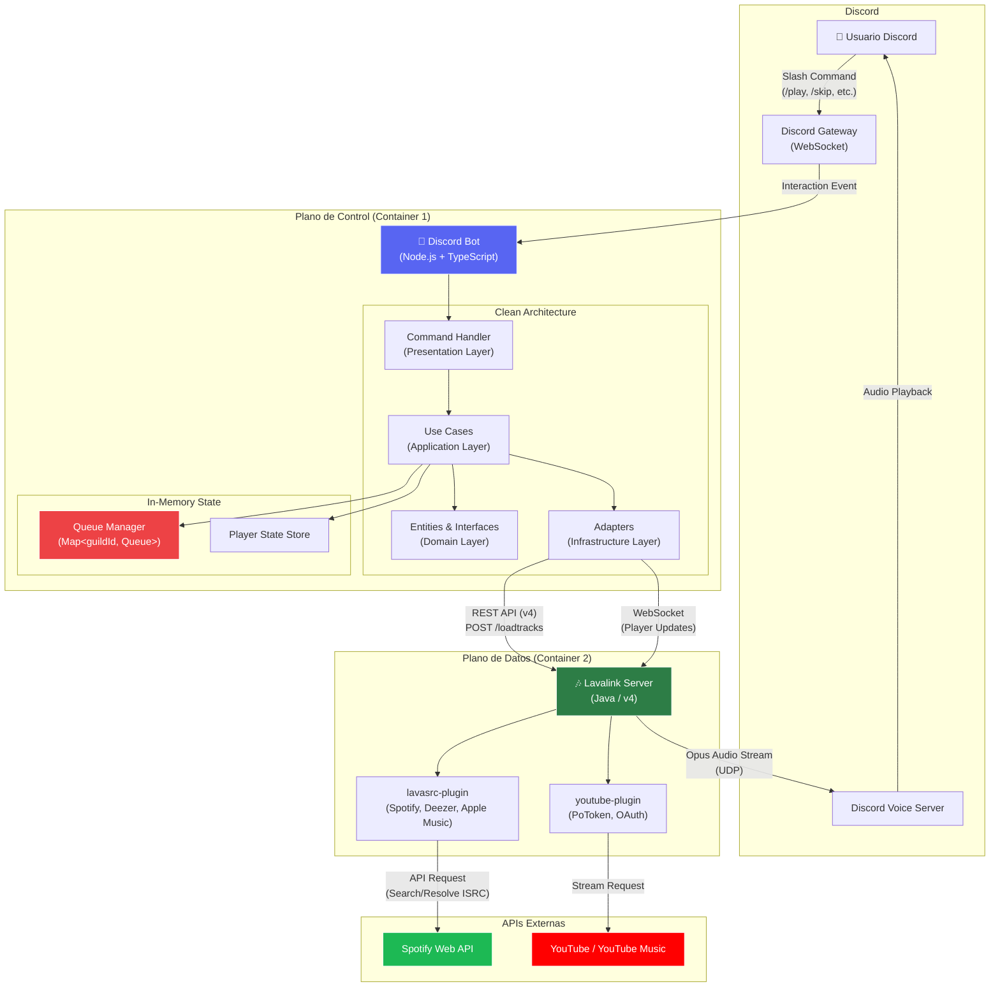
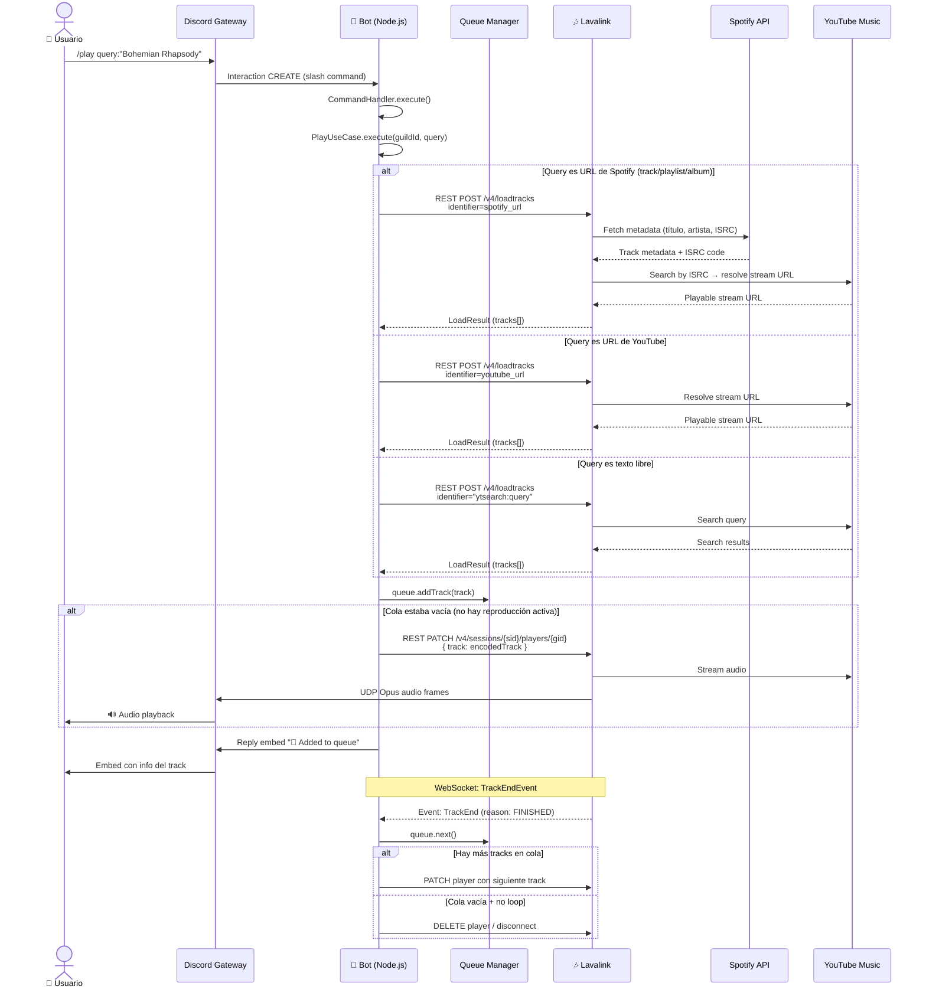
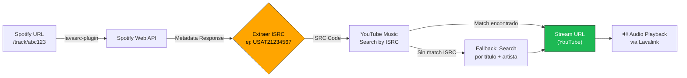
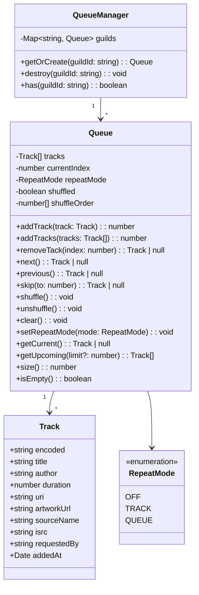
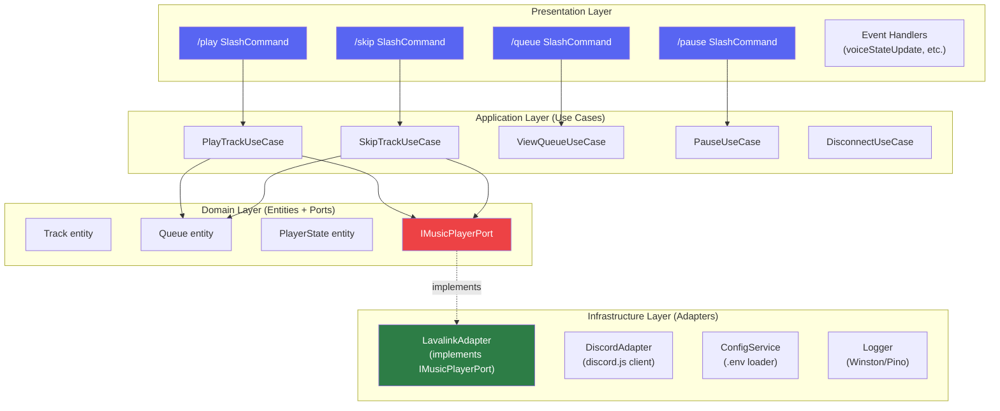
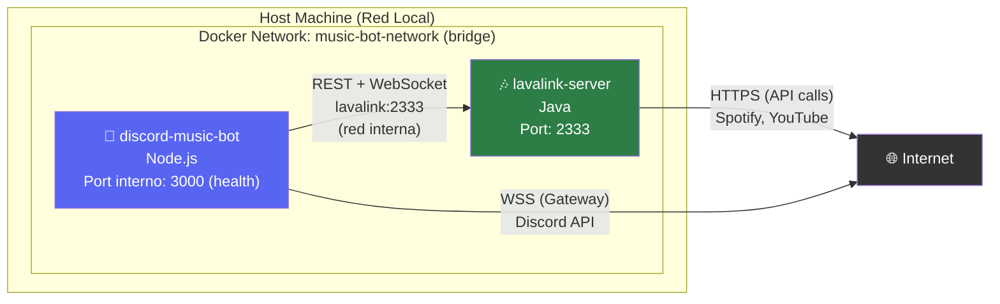

# 🎵 Discord Music Bot — Diseño Arquitectónico Completo

> Bot de música privado para Discord con soporte de búsqueda por texto, playlists de Spotify (vía ISRC) y YouTube Music, optimizado para ejecución 24/7 en entorno local.

---

## User Review Required

> [!IMPORTANT]
> **Decisiones que requieren validación del equipo antes de generar código:**
> 1. ¿El bot operará en un solo guild (servidor) o debe soportar múltiples guilds simultáneamente? El diseño actual asume **multi-guild** con una instancia de `Queue` por guild.
> 2. ¿Se requiere persistencia de colas entre reinicios del bot (ej. Redis/SQLite) o es aceptable perder la cola al reiniciar?
> 3. ¿El volumen y los modos de repetición deben ser por usuario o por guild?
> 4. ¿Desean un sistema de permisos basado en roles de Discord (ej. solo DJs pueden saltar) o control libre?

> [!WARNING]
> **Spotify no provee streams de audio directamente.** El flujo de resolución usa el plugin `lavasrc` para extraer metadatos (título, artista, ISRC) de Spotify y luego resuelve el audio real a través de YouTube Music usando el código ISRC como puente. Esto es transparente para el usuario pero implica una dependencia doble.

---

## PASO 1: Diagrama de Arquitectura y Flujo de Datos

### 1.1 Arquitectura General — Vista de Componentes



### 1.2 Flujo de Datos — Comando `/play`

Este diagrama detalla el flujo completo desde que un usuario solicita una canción hasta que el audio se reproduce:



### 1.3 Flujo de Datos — Resolución Spotify vía ISRC



### 1.4 Diseño de la Cola de Reproducción (Queue) en Memoria

La cola se implementa como una estructura de datos eficiente para las operaciones típicas de un reproductor de música:



#### Complejidad de Operaciones de la Cola

| Operación | Estructura | Complejidad | Notas |
|-----------|-----------|-------------|-------|
| `addTrack` | Array.push | O(1) amortizado | Inserción al final |
| `next` | Index increment | O(1) | Solo mueve el puntero `currentIndex` |
| `previous` | Index decrement | O(1) | Solo mueve el puntero |
| `skip(to)` | Index assignment | O(1) | Salto directo por índice |
| `remove(i)` | Array.splice | O(n) | Raro en uso real, aceptable |
| `shuffle` | Fisher-Yates sobre índices | O(n) | Genera `shuffleOrder[]` sin mutar `tracks[]` |
| `clear` | Array reset + index reset | O(1) | `tracks = []; currentIndex = 0` |
| `getCurrent` | Index access | O(1) | Acceso directo |
| `getUpcoming` | Array.slice | O(k) | k = cantidad solicitada |

> [!TIP]
> **Decisión de diseño:** El shuffle no reordena el array `tracks[]` directamente. En su lugar, genera un array de índices `shuffleOrder[]` y la navegación usa ese mapeo indirecto. Esto permite hacer `unshuffle()` sin perder el orden original, que es el comportamiento esperado por usuarios de Spotify/YouTube.

---

## PASO 2: Contratos de Interfaces y Esquema de Configuración

### 2.1 Interfaces TypeScript — Capa de Dominio

```typescript
// ═══════════════════════════════════════════════════════════════
// src/domain/entities/Track.ts
// ═══════════════════════════════════════════════════════════════

export interface Track {
  /** Encoded track string from Lavalink (opaque, used for playback) */
  readonly encoded: string;

  /** Track metadata */
  readonly info: TrackInfo;

  /** ID of the Discord user who requested this track */
  readonly requestedBy: string;

  /** Timestamp when the track was added to the queue */
  readonly addedAt: Date;
}

export interface TrackInfo {
  readonly title: string;
  readonly author: string;
  readonly duration: number;       // milliseconds
  readonly identifier: string;     // platform-specific ID
  readonly uri: string;            // original URL
  readonly artworkUrl: string | null;
  readonly isrc: string | null;    // International Standard Recording Code
  readonly sourceName: string;     // 'youtube' | 'spotify' | 'deezer'
  readonly isStream: boolean;      // true for livestreams
  readonly position: number;       // current position in ms
}
```

```typescript
// ═══════════════════════════════════════════════════════════════
// src/domain/entities/Playlist.ts
// ═══════════════════════════════════════════════════════════════

export interface Playlist {
  readonly name: string;
  readonly tracks: Track[];
  readonly selectedTrack: number | null; // index of the initially selected track
  readonly source: PlaylistSource;
}

export type PlaylistSource = 'spotify' | 'youtube' | 'custom';
```

```typescript
// ═══════════════════════════════════════════════════════════════
// src/domain/entities/Queue.ts
// ═══════════════════════════════════════════════════════════════

export enum RepeatMode {
  OFF = 'OFF',
  TRACK = 'TRACK',
  QUEUE = 'QUEUE',
}

export interface IQueue {
  /** All tracks in the queue (original order) */
  readonly tracks: ReadonlyArray<Track>;

  /** Current playback position index */
  readonly currentIndex: number;

  /** Current repeat mode */
  readonly repeatMode: RepeatMode;

  /** Whether shuffle is active */
  readonly isShuffled: boolean;

  // ── Mutations ──
  addTrack(track: Track): number;
  addTracks(tracks: Track[]): number;
  removeTrack(index: number): Track | null;
  next(): Track | null;
  previous(): Track | null;
  skipTo(index: number): Track | null;
  shuffle(): void;
  unshuffle(): void;
  clear(): void;
  setRepeatMode(mode: RepeatMode): void;

  // ── Queries ──
  getCurrent(): Track | null;
  getUpcoming(limit?: number): Track[];
  getHistory(limit?: number): Track[];
  size(): number;
  isEmpty(): boolean;
  totalDuration(): number;
}
```

```typescript
// ═══════════════════════════════════════════════════════════════
// src/domain/entities/PlayerState.ts
// ═══════════════════════════════════════════════════════════════

export enum PlayerStatus {
  IDLE = 'IDLE',
  PLAYING = 'PLAYING',
  PAUSED = 'PAUSED',
  LOADING = 'LOADING',
  DESTROYED = 'DESTROYED',
}

export interface PlayerState {
  readonly guildId: string;
  readonly voiceChannelId: string | null;
  readonly textChannelId: string;
  readonly status: PlayerStatus;
  readonly volume: number;           // 0-100
  readonly position: number;         // current position in ms
  readonly currentTrack: Track | null;
  readonly queue: IQueue;
  readonly connectedAt: Date | null;
  readonly filters: AudioFilters;
}

export interface AudioFilters {
  readonly bassboost: boolean;
  readonly nightcore: boolean;
  readonly vaporwave: boolean;
  readonly karaoke: boolean;
  // Extensible: agregar filtros según necesidad
}
```

```typescript
// ═══════════════════════════════════════════════════════════════
// src/domain/ports/MusicPlayerPort.ts (Puerto — Hexagonal Arch)
// ═══════════════════════════════════════════════════════════════

/**
 * Puerto de salida hacia el sistema de audio.
 * El adaptador de Lavalink implementará esta interfaz.
 */
export interface IMusicPlayerPort {
  connect(guildId: string, voiceChannelId: string): Promise<void>;
  disconnect(guildId: string): Promise<void>;
  play(guildId: string, track: Track): Promise<void>;
  pause(guildId: string): Promise<void>;
  resume(guildId: string): Promise<void>;
  stop(guildId: string): Promise<void>;
  seek(guildId: string, positionMs: number): Promise<void>;
  setVolume(guildId: string, volume: number): Promise<void>;
  setFilters(guildId: string, filters: AudioFilters): Promise<void>;
  loadTracks(query: string): Promise<LoadResult>;
  destroyPlayer(guildId: string): Promise<void>;
}

export interface LoadResult {
  readonly loadType: 'track' | 'playlist' | 'search' | 'empty' | 'error';
  readonly tracks: Track[];
  readonly playlist: Playlist | null;
  readonly error: string | null;
}
```

### 2.2 Estructura de Capas — Clean Architecture



### 2.3 Configuración de Lavalink — `application.yml`

```yaml
# ═══════════════════════════════════════════════════════════════
# Lavalink Server Configuration — application.yml
# ═══════════════════════════════════════════════════════════════

server:
  port: 2333                          # Puerto HTTP/WS del servidor Lavalink
  address: 0.0.0.0                    # Escuchar en todas las interfaces (necesario en Docker)

lavalink:
  server:
    password: "${LAVALINK_SERVER_PASSWORD}"  # Contraseña compartida con el bot
    sources:
      youtube: false                  # Deshabilitado: se usa youtube-plugin en su lugar
      bandcamp: true
      soundcloud: true
      twitch: true
      vimeo: false
      http: true                      # Permite URLs directas
      local: false
    filters:
      volume: true
      equalizer: true
      karaoke: true
      timescale: true
      tremolo: true
      vibrato: true
      distortion: true
      rotation: true
      channelMix: true
      lowPass: true
    bufferDurationMs: 400
    frameBufferDurationMs: 5000
    youtubePlaylistLoadLimit: 100     # Máximo tracks por playlist
    playerUpdateInterval: 5           # Intervalo de actualización en segundos
    youtubeSearchEnabled: true
    soundcloudSearchEnabled: true
    gc-warnings: true

# ── Plugin: lavasrc (Spotify, Deezer, Apple Music resolvers) ──
plugins:
  lavasrc:
    providers:
      # Orden de prioridad para resolución de audio
      - "ytsearch:\"%ISRC%\""          # 1. Buscar por ISRC en YouTube
      - "ytsearch:%QUERY%"             # 2. Fallback: buscar por texto
    sources:
      spotify: true
      deezer: false
      applemusic: false
      yandexmusic: false
      flowerytts: false
      youtube: true
    spotify:
      clientId: "${SPOTIFY_CLIENT_ID}"
      clientSecret: "${SPOTIFY_CLIENT_SECRET}"
      countryCode: "CL"               # Código ISO del país (ajustar según equipo)
      playlistLoadLimit: 6             # Páginas de 100 tracks (600 max)
      albumLoadLimit: 6

  # ── Plugin: youtube (sesiones seguras con PoToken/OAuth) ──
  youtube:
    enabled: true
    allowSearch: true
    allowDirectVideoIds: true
    allowDirectPlaylistIds: true
    clients:
      - "MUSIC"                        # YouTube Music (mejor calidad para música)
      - "WEB"                          # Fallback a cliente web
      - "ANDROID_TESTSUITE"            # Fallback adicional
    # ── Opciones de autenticación (elegir una) ──
    # Opción A: OAuth (recomendado para uso privado)
    oauth:
      enabled: true
      # El token se generará en el primer arranque vía logs del contenedor
      # Seguir instrucciones de: https://github.com/lavalink-devs/youtube-source
    # Opción B: PoToken (alternativa sin cuenta Google)
    # pot-token:
    #   token: "${YOUTUBE_POT_TOKEN}"
    #   visitorData: "${YOUTUBE_VISITOR_DATA}"

logging:
  file:
    path: ./logs/

  level:
    root: INFO
    lavalink: INFO
    com.sedmelluq.discord.lavaplayer: WARN   # Reducir ruido de lavaplayer

  logback:
    rollingpolicy:
      max-file-size: 25MB
      max-history: 7
```

### 2.4 Variables de Entorno — `.env` (Plano de Control)

```bash
# ═══════════════════════════════════════════════════════════════
# Discord Bot Configuration (.env)
# ═══════════════════════════════════════════════════════════════

# ── Discord ──
DISCORD_TOKEN=                        # Bot token de Discord Developer Portal
DISCORD_CLIENT_ID=                    # Application ID para registrar slash commands
DISCORD_GUILD_ID=                     # (Opcional) ID del guild para comandos de desarrollo

# ── Lavalink Connection ──
LAVALINK_HOST=lavalink                # Nombre del servicio en docker-compose
LAVALINK_PORT=2333                    # Puerto configurado en application.yml
LAVALINK_PASSWORD=                    # Debe coincidir con LAVALINK_SERVER_PASSWORD

# ── Spotify API Credentials ──
SPOTIFY_CLIENT_ID=                    # Desde Spotify Developer Dashboard
SPOTIFY_CLIENT_SECRET=                # Desde Spotify Developer Dashboard

# ── Bot Settings ──
BOT_DEFAULT_VOLUME=80                 # Volumen por defecto (0-100)
BOT_MAX_QUEUE_SIZE=500                # Máximo de tracks en cola por guild
BOT_INACTIVITY_TIMEOUT=300           # Segundos de inactividad antes de desconectar (5 min)
BOT_PREFIX=!                          # Prefijo para comandos de texto (backup de slash)

# ── Logging ──
LOG_LEVEL=info                        # debug | info | warn | error
NODE_ENV=production                   # production | development
```

> [!CAUTION]
> **Seguridad de credenciales:** El archivo `.env` NUNCA debe versionarse en Git. Agregar `.env` al `.gitignore` y distribuir solo un archivo `.env.example` con valores vacíos como plantilla.

---

## PASO 3: Diseño de Infraestructura como Código (IaC)

### 3.1 Docker Compose — `docker-compose.yml`

```yaml
# ═══════════════════════════════════════════════════════════════
# Docker Compose — Discord Music Bot Stack
# ═══════════════════════════════════════════════════════════════
version: "3.9"

services:
  # ────────────────────────────────────────────────────────────
  # Plano de Control: Discord Bot (Node.js + TypeScript)
  # ────────────────────────────────────────────────────────────
  bot:
    build:
      context: ./bot
      dockerfile: Dockerfile
    container_name: discord-music-bot
    restart: always
    depends_on:
      lavalink:
        condition: service_healthy
    env_file:
      - .env
    environment:
      - LAVALINK_HOST=lavalink         # Override para red interna Docker
      - LAVALINK_PORT=2333
    networks:
      - music-net
    volumes:
      - bot-logs:/app/logs
    deploy:
      resources:
        limits:
          memory: 512M
          cpus: "1.0"
        reservations:
          memory: 256M
          cpus: "0.25"
    healthcheck:
      test: ["CMD", "node", "-e", "require('http').get('http://localhost:3000/health', (r) => process.exit(r.statusCode === 200 ? 0 : 1))"]
      interval: 30s
      timeout: 10s
      retries: 3
      start_period: 15s

  # ────────────────────────────────────────────────────────────
  # Plano de Datos: Lavalink Server (Java)
  # ────────────────────────────────────────────────────────────
  lavalink:
    image: ghcr.io/lavalink-devs/lavalink:4           # Imagen oficial Lavalink v4
    container_name: lavalink-server
    restart: always
    environment:
      - _JAVA_OPTIONS=-Xmx512M -Xms128M               # Limitar heap de Java
      - LAVALINK_SERVER_PASSWORD=${LAVALINK_PASSWORD}
      - SPOTIFY_CLIENT_ID=${SPOTIFY_CLIENT_ID}
      - SPOTIFY_CLIENT_SECRET=${SPOTIFY_CLIENT_SECRET}
    volumes:
      - ./lavalink/application.yml:/opt/Lavalink/application.yml:ro
      - ./lavalink/plugins/:/opt/Lavalink/plugins/     # Plugins JAR pre-descargados
      - lavalink-logs:/opt/Lavalink/logs
    networks:
      - music-net
    ports:
      - "2333:2333"                                     # Exponer solo si necesario para debug
    deploy:
      resources:
        limits:
          memory: 768M
          cpus: "2.0"
        reservations:
          memory: 256M
          cpus: "0.5"
    healthcheck:
      test: ["CMD-SHELL", "curl -sf http://localhost:2333/version || exit 1"]
      interval: 15s
      timeout: 5s
      retries: 5
      start_period: 30s

# ── Redes ──
networks:
  music-net:
    driver: bridge
    name: music-bot-network

# ── Volúmenes Persistentes ──
volumes:
  bot-logs:
    name: discord-bot-logs
  lavalink-logs:
    name: lavalink-server-logs
```

### 3.2 Diagrama de Red Docker



### 3.3 Dockerfile — Bot (Node.js)

```dockerfile
# ═══════════════════════════════════════════════════════════════
# bot/Dockerfile — Multi-stage build
# ═══════════════════════════════════════════════════════════════

# ── Stage 1: Build ──
FROM node:22-alpine AS builder

WORKDIR /app

# Copiar manifiestos primero para aprovechar cache de Docker
COPY package.json package-lock.json tsconfig.json ./

RUN npm ci --ignore-scripts

# Copiar código fuente y compilar
COPY src/ ./src/

RUN npm run build

# ── Stage 2: Production ──
FROM node:22-alpine AS production

# Metadata
LABEL maintainer="Equipo Música Bot"
LABEL description="Discord Music Bot - Control Plane"

WORKDIR /app

# Instalar solo dependencias de producción
COPY package.json package-lock.json ./
RUN npm ci --omit=dev --ignore-scripts && npm cache clean --force

# Copiar artefactos compilados desde builder
COPY --from=builder /app/dist ./dist

# Crear directorio de logs
RUN mkdir -p /app/logs

# Ejecutar como usuario no-root
RUN addgroup -S appgroup && adduser -S appuser -G appgroup
USER appuser

# Health check endpoint
EXPOSE 3000

CMD ["node", "dist/main.js"]
```

### 3.4 Estructura de Plugins Lavalink

Los plugins deben descargarse manualmente y colocarse antes del primer arranque:

```
lavalink/
├── application.yml
└── plugins/
    ├── lavasrc-plugin-x.x.x.jar          # github.com/topi314/LavaSrc
    └── youtube-plugin-x.x.x.jar          # github.com/lavalink-devs/youtube-source
```

> [!NOTE]
> **Alternativa automática:** Lavalink v4 soporta descarga automática de plugins declarándolos en `application.yml` bajo la clave `lavalink.plugins`. Sin embargo, para un entorno local/privado 24/7, pre-descargar los JARs es más confiable y evita dependencia de red en cada reinicio.

---

## PASO 4: Estructura de Carpetas Propuesta (Preview)

> [!NOTE]
> Este paso se ejecutará **después de la aprobación** de los pasos 1-3. Se incluye como referencia para el equipo.

```
discord-music-bot/
├── docker-compose.yml
├── .env.example
├── .gitignore
├── README.md
│
├── bot/                                   # Plano de Control
│   ├── Dockerfile
│   ├── package.json
│   ├── tsconfig.json
│   ├── .eslintrc.json
│   └── src/
│       ├── main.ts                        # Entry point
│       ├── config/
│       │   └── environment.ts             # Typed env loader + validation
│       ├── domain/                        # Capa de Dominio (sin deps externas)
│       │   ├── entities/
│       │   │   ├── Track.ts
│       │   │   ├── Playlist.ts
│       │   │   ├── Queue.ts               # Implementación de IQueue
│       │   │   └── PlayerState.ts
│       │   └── ports/
│       │       ├── MusicPlayerPort.ts      # IMusicPlayerPort
│       │       └── QueueManagerPort.ts     # IQueueManager
│       ├── application/                   # Capa de Aplicación (Use Cases)
│       │   ├── PlayTrackUseCase.ts
│       │   ├── SkipTrackUseCase.ts
│       │   ├── PauseResumeUseCase.ts
│       │   ├── StopUseCase.ts
│       │   ├── QueueViewUseCase.ts
│       │   ├── ShuffleUseCase.ts
│       │   ├── RepeatUseCase.ts
│       │   ├── VolumeUseCase.ts
│       │   ├── SeekUseCase.ts
│       │   └── NowPlayingUseCase.ts
│       ├── infrastructure/                # Capa de Infraestructura (Adapters)
│       │   ├── lavalink/
│       │   │   ├── LavalinkAdapter.ts     # Implementa IMusicPlayerPort
│       │   │   ├── LavalinkEventHandler.ts
│       │   │   └── LavalinkTypes.ts       # Tipos de la API REST v4
│       │   ├── discord/
│       │   │   ├── DiscordClient.ts       # Setup de discord.js
│       │   │   ├── CommandRegistrar.ts    # Registro global de slash commands
│       │   │   └── EmbedBuilder.ts        # Factory de embeds bonitos
│       │   ├── state/
│       │   │   └── InMemoryQueueManager.ts
│       │   └── logger/
│       │       └── Logger.ts
│       └── presentation/                  # Capa de Presentación (Commands)
│           ├── commands/
│           │   ├── PlayCommand.ts
│           │   ├── SkipCommand.ts
│           │   ├── PauseCommand.ts
│           │   ├── ResumeCommand.ts
│           │   ├── StopCommand.ts
│           │   ├── QueueCommand.ts
│           │   ├── NowPlayingCommand.ts
│           │   ├── ShuffleCommand.ts
│           │   ├── RepeatCommand.ts
│           │   ├── VolumeCommand.ts
│           │   └── SeekCommand.ts
│           ├── events/
│           │   ├── InteractionCreate.ts
│           │   ├── VoiceStateUpdate.ts
│           │   └── Ready.ts
│           └── middleware/
│               ├── VoiceChannelGuard.ts   # Verificar que el usuario está en un canal
│               └── CooldownGuard.ts       # Rate limiting por usuario
│
└── lavalink/                              # Plano de Datos
    ├── application.yml
    └── plugins/
        ├── lavasrc-plugin-x.x.x.jar
        └── youtube-plugin-x.x.x.jar
```

---

## Verificación Plan

### Automated Tests
- **Unit Tests**: Tests de la clase `Queue` (add, remove, next, previous, shuffle, repeat modes) con Jest/Vitest
- **Integration Tests**: Test de conexión Bot ↔ Lavalink usando un contenedor de test
- **Lint/Type Check**: `npm run lint && npm run typecheck` en CI

### Manual Verification
- Deploy local con `docker-compose up -d` y verificar:
  - Bot online en Discord (estado visible)
  - `/play` con URL de YouTube reproduce audio
  - `/play` con URL de Spotify resuelve vía ISRC y reproduce
  - `/play` con texto libre busca en YouTube
  - `/skip`, `/pause`, `/resume`, `/queue` funcionan correctamente
  - Bot se desconecta automáticamente tras inactividad
  - Ambos contenedores se reinician tras un `docker kill`

---

## Open Questions

> [!IMPORTANT]
> **Preguntas para el equipo antes de proceder al código:**

1. **Multi-guild vs Single-guild:** ¿El bot se usará en un solo servidor de Discord o en varios? Esto afecta la gestión de recursos y el sharding.

2. **Persistencia de cola:** ¿Es aceptable perder la cola de reproducción si el bot se reinicia, o necesitan persistencia (SQLite/Redis)?

3. **Sistema de permisos:** ¿Implementamos un sistema de roles (ej. rol "DJ" para comandos destructivos como `/stop` y `/clear`) o todos los usuarios tienen acceso completo?

4. **Autenticación YouTube:** ¿Prefieren **OAuth** (requiere una cuenta Google, más estable a largo plazo) o **PoToken** (sin cuenta, pero requiere renovación periódica)?

5. **Librería cliente Lavalink:** ¿Tienen preferencia entre **Shoukaku** (ligero, flexible), **Lavalink-Client** (oficial), o **Erela.js/Magmastream** (más features built-in)?

6. **Descarga de plugins:** ¿Prefieren pre-descargar los JARs de plugins manualmente, o usar la declaración en `application.yml` para descarga automática al iniciar Lavalink?
